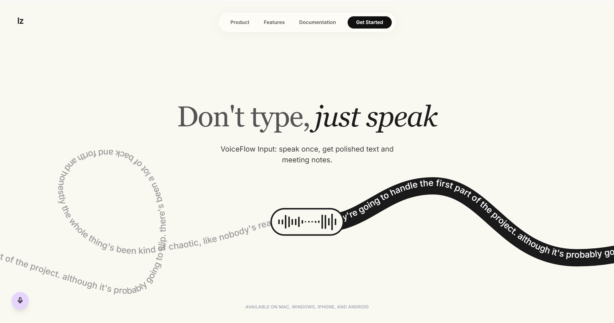
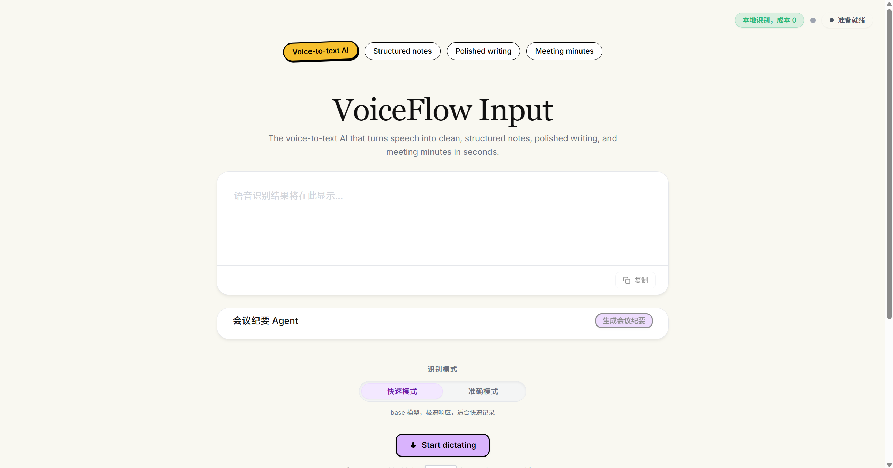
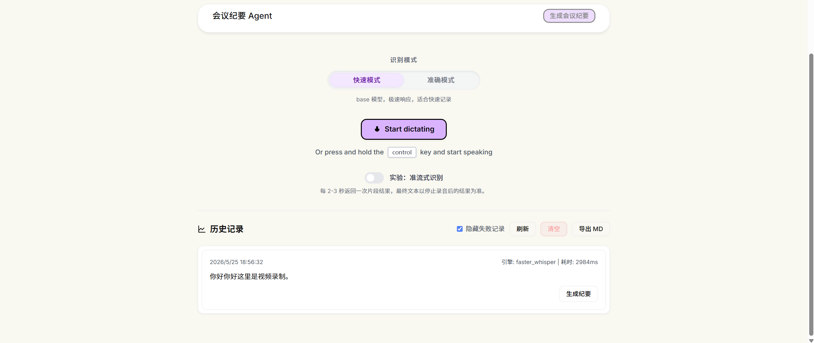

# VoiceFlow Input

VoiceFlow Input is a Web-first voice input workspace that turns browser-recorded speech into polished text, reusable history, Markdown exports, and structured meeting minutes.

> Don't type, just speak. VoiceFlow Input helps users turn spoken ideas into clean text and actionable meeting notes.

## Demo Videos

- Main demo (Bilibili): [https://www.bilibili.com/video/BV1ecGR65EC8/](https://www.bilibili.com/video/BV1ecGR65EC8/)
- Backup video (Baidu Netdisk): [https://pan.baidu.com/s/1YivE30dtPKTyN3ROcydn-w?pwd=y47c](https://pan.baidu.com/s/1YivE30dtPKTyN3ROcydn-w?pwd=y47c)
- Baidu extraction code: `y47c`

## Screenshots

### Landing



### Voice Input Workspace



### History And Meeting Minutes Entry



## What Is VoiceFlow Input?

VoiceFlow Input is built for users who need to turn speech into usable text quickly: students, office users, developers, and meeting note takers.

Instead of building a native OS input method kernel in 72 hours, this project focuses on a reproducible Web-first voice input workflow:

```text
browser recording -> WebSocket -> FastAPI -> faster-whisper -> text normalization -> history/export -> structured meeting minutes
```

This keeps the MVP runnable, reviewable, and easy to demonstrate while still addressing the core goal of improving text input efficiency.

## Key Features

- Browser microphone recording with WebSocket upload.
- Local ASR with `faster-whisper`.
- Fast / accurate ASR mode selection.
- Simplified Chinese normalization with OpenCC.
- Hotword enhancement for mixed Chinese/English technical terms.
- Audio quality warnings and staged latency metrics.
- Transcript history with local JSON persistence.
- Markdown export for reusable notes.
- DeepSeek-powered structured meeting minutes.
- Local fallback when AI provider is unavailable.
- ASR evaluation script for CER, hotword hit rate, latency, and zero ASR API cost evidence.

## Product Workflow

```text
Speak
  -> transcribe locally
  -> normalize and polish text
  -> copy or save to history
  -> export Markdown
  -> generate structured meeting minutes
```

## Topic Fit

The selected topic is "Voice Input Method": build a voice input product that improves text input efficiency and balances accuracy, usability, response speed, and cost.

| Requirement | Implementation |
|---|---|
| Accuracy | `faster-whisper`, `language=zh`, simplified Chinese normalization, hotword correction, fast/accurate modes, CER evaluation |
| Usability | browser recording, copy button, transcript history, Markdown export, structured meeting minutes |
| Response speed | model caching, staged latency metrics, fast mode with base model |
| Cost | local ASR path with `0` ASR API cost; DeepSeek is optional for meeting minutes |

## Architecture

```text
Browser Recorder
  -> WebSocket audio chunks
  -> FastAPI backend
  -> ASR adapter
      -> mock adapter for tests
      -> faster-whisper for real local ASR
  -> text normalization / hotword postprocess
  -> transcript result
  -> history / Markdown export
  -> optional DeepSeek structured meeting minutes
```

## Quick Start

### Backend

```powershell
cd D:\qiniu\backend
python -m venv .venv
.\.venv\Scripts\Activate.ps1
python -m pip install -r requirements.txt

$env:ASR_ENGINE="faster_whisper"
$env:FASTER_WHISPER_DEVICE="cpu"
$env:FASTER_WHISPER_COMPUTE_TYPE="int8"
$env:DEFAULT_LANGUAGE="zh"

python -m uvicorn app.main:app --host 127.0.0.1 --port 8000
```

### Frontend

```powershell
cd D:\qiniu\frontend-vue
npm install
npm run dev
```

Open:

```text
http://localhost:5173
```

Detailed backend config, protocol, and test commands are in [backend/README.md](backend/README.md).

## Optional Meeting Minutes Provider

DeepSeek is used only for structured meeting minutes. The frontend never receives provider keys.

```powershell
$env:AI_MEETING_SUMMARY_ENABLED="true"
$env:MEETING_SUMMARY_PROVIDER="deepseek"
$env:DEEPSEEK_API_KEY="your_deepseek_api_key"
$env:DEEPSEEK_API_BASE_URL="https://api.deepseek.com"
$env:DEEPSEEK_MODEL="deepseek-v4-flash"
```

If the provider is unavailable, the backend returns a local structured fallback instead of breaking the UI.

## ASR Hotwords

Hotwords can be injected through backend environment variables. They are used by the ASR prompt and postprocess correction.

```powershell
$env:ASR_HOTWORDS="VoiceFlow Input,faster-whisper,FastAPI,WebSocket,OpenCC,GitHub,Markdown,DeepSeek,七牛云,Kodo,对象存储,实训营,路演,PR,commit,README"
```

The response only exposes whether hotwords are enabled and the count. It does not return the full hotword list by default.

## Evaluation

The project includes a local ASR evaluation script:

```powershell
cd D:\qiniu\backend
Copy-Item eval_manifest.example.json eval_manifest.json
python tools\evaluate_asr.py --manifest eval_manifest.json --output eval_report.json
```

It reports:

- `CER`: character error rate for Chinese transcription.
- `hotword_hit_rate`: whether configured demo terms are recognized.
- `latency_ms`: end-to-end local recognition time.
- `asr_cost_cents`: `0` for local `faster-whisper` ASR.

Personal audio samples and generated reports are ignored by Git.

## API Overview

- `GET /health`: backend health and active ASR config.
- `WS /ws/transcribe`: browser audio transcription.
- `GET /history`: list transcript history.
- `DELETE /history`: clear transcript history.
- `GET /export/markdown`: export transcript history as Markdown.
- `POST /ai/meeting-summary`: generate structured meeting minutes from transcript text.

## Project Structure

```text
backend/
  app/                 FastAPI app, ASR adapters, postprocess, history, AI summary
  tests/               smoke tests and contract checks
  tools/               local ASR evaluation tools
  eval_manifest.example.json

frontend-vue/
  src/                 Vue 3 frontend
  src/composables/     WebSocket, history, export, meeting agent logic

project/docs/          planning, architecture, contracts, acceptance cases
```

## Security And Privacy

- API keys are backend-only environment variables.
- The frontend never receives DeepSeek or Xiaomi keys.
- Raw audio is not saved in history.
- Local history stores only transcript text and metadata.
- `.env`, audio files, model files, evaluation reports, and local history JSON are ignored by Git.
- Provider errors are sanitized before returning to the frontend.

## Dependencies And Original Work

Direct dependencies:

- FastAPI: backend HTTP and WebSocket service.
- `faster-whisper`: local ASR engine through the official Python package.
- OpenCC: simplified Chinese normalization.
- Vue 3 + Vite: frontend application.
- DeepSeek API: optional structured meeting minutes provider.

Reference-only projects:

- Whisper / faster-whisper: ASR usage and model tradeoff reference.
- WhisperLive: WebSocket streaming product inspiration.
- whisper.cpp / sherpa-onnx: future local or streaming ASR reference.

No third-party source code, README text, UI implementation, or repository structure was copied into this project.

## Known Limitations

- This is a Web-first voice input workspace, not a native OS input method kernel.
- Default mode is record-then-transcribe; segment streaming is experimental.
- Recognition quality depends on microphone quality, background noise, and selected model.
- Desktop shell and native IME integration are future extensions.

## Submission Notes

- Repository: [https://github.com/lllllzzzz224/VoiceFlow-input](https://github.com/lllllzzzz224/VoiceFlow-input)
- Topic: Voice Input Method.
- Main delivery form: Web voice input workspace.
- Demo links are placed at the top of this README for review.
