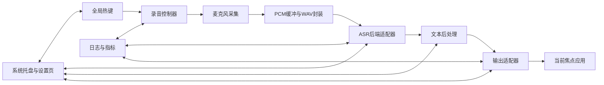
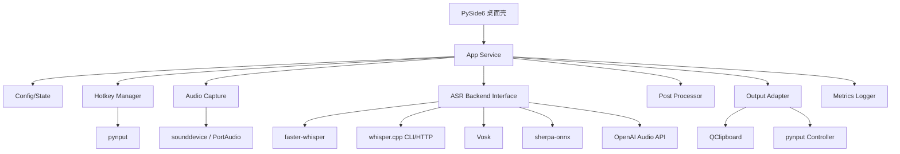

# 48小时桌面语音输入助手实施研究报告

## 执行摘要

本报告的核心结论是：**在 48 小时内，最可交付、风险最低、答辩最稳的做法，不是去做“真正的原生输入法插件”，而是做一个“桌面语音输入助手”——系统托盘常驻、全局热键按下开始录音/松开结束、完成转写后把文本提交到当前焦点应用**。这样可以避开输入法框架级别的插件开发复杂度，同时保留“跨应用输入”的用户价值。Fcitx 官方开发教程本身就把“写一个输入法”定义为 C++/CMake 的共享库插件工程，并假定 Linux/FreeBSD 开发环境；Rime 也以可扩展核心库和前端/插件体系为主，这些都更像后续演进方向，而不是 48 小时 MVP。citeturn41view0turn5view1turn33view3

在 ASR 后端上，**推荐“本地优先：faster-whisper；打包/弱网/纯离线备选：whisper.cpp；极轻量 CPU 备选：Vosk；未来扩展唤醒词/VAD/双语流式：sherpa-onnx；云端兜底：Xiaomi API”**。之所以把 `faster-whisper` 放在第一位，是因为它直接提供 Python 集成、`WhisperModel` 调用方式、词级时间戳、内置 Silero VAD、批处理推理，以及从 Hugging Face 自动下载 CTranslate2 模型的便利性；这非常适合 48 小时内快速拼出桌面应用、测延迟、补测试和打包。`whisper.cpp` 则在**模型体积、纯本地部署、量化与多平台二进制打包**方面非常强，适合第二阶段优化或作为交付中的“纯离线可运行说明”。Vosk 的卖点是**50MB 级模型、离线、流式、可配置词表**；sherpa-onnx 的卖点是**VAD、KWS、流式麦克风、WebSocket、跨平台和多语言 API 示例极完整**。citeturn22view3turn36view2turn21view0turn20view0turn42view1

从成本看，这个项目完全可以做到**云成本接近 0**：若本地运行，额外云推理费用为零；若用 Hugging Face Inference Endpoints，CPU 端点最低从 **$0.033/小时**起，T4 GPU 约 **$0.50/小时**，L4 约 **$0.80/小时**；若使用 OpenAI 作为兜底，`gpt-4o-mini-transcribe` 官方标价约 **$0.003/分钟**，`gpt-4o-transcribe` 约 **$0.006/分钟**，`gpt-realtime-whisper` 约 **$0.017/分钟**。以 180 分钟调试量计，成本大致分别是 **$0.54 / $1.08 / $3.06**。若需要把录音样本临时存到 S3，S3 Standard 官方价约 **$0.023/GB/月**，5GB 仅约 **$0.115/月**。citeturn12view3turn12view4turn12view1turn12view2turn37calculator0turn37calculator1turn37calculator2turn13search0turn37calculator3

从开发辅助工具看，**Codex/ChatGPT/Codex-like 工具对这个题目极其友好**。Codex 官方定位就是能“读、改、运行代码”的编码代理，并提供 IDE/云工作区集成；ChatGPT Canvas 官方支持对代码做 inline review、加日志、加注释、修 bug；Copilot 类工具也已支持 agent mode、仓库研究、改文件、跑终端和修编译错误。这意味着：项目骨架、设置页、托盘 UI、后端适配器、pytest 测试、打包脚本、README、演示视频脚本，都非常适合交给代理式工具起草；真正要人工收口的，是**音频线程、全局热键权限、文本注入可靠性、平台差异和基准测试**。citeturn8view0turn8view1turn24view2turn24view3turn24view0turn24view1

## 关键维度比较表

下表先比较**产品形态路线**。结论很明确：**48 小时 MVP 应做“桌面按键触发听写助手”，不要做“原生输入法框架插件”**。

| 路线 | 48小时可交付性 | 架构清晰度 | 关键依赖 | 成本 | 开源/闭源比例 | 结论 | 主来源 |
|---|---|---|---|---|---|---|---|
| 原生输入法插件 | 低。Fcitx 官方教程要求 C++/CMake 共享库插件与输入法注册文件；Rime 也是核心库 + 前端/插件体系，更适合作为后续演进而非 48h 首版。 | 中到低。需处理输入法上下文、候选窗、preedit、按键事件生命周期。 | Fcitx5 / librime / 平台输入法框架。 | 云成本低，但工程时间成本最高。 | 开源占比高。 | **不推荐作为 48h MVP**。 | citeturn41view0turn5view1turn33view3 |
| 桌面按键触发听写助手 + 本地 ASR | 高。托盘、全局热键、麦克风录音、转写、提交文本的链路边界清晰。 | 高。可自然拆成 UI、热键、采集、ASR、后处理、输出适配器。 | PySide6、sounddevice、pynput、faster-whisper/whisper.cpp。 | 可做到接近 0 云成本。 | 约 85%–95% 开源（按关键运行路径粗估）。 | **推荐路线**。 | citeturn14search0turn29search1turn28view0turn28view1turn22view3turn36view2 |
| 桌面按键触发听写助手 + 云 API 兜底或混合 | 高。最容易拿到可演示结果，实时/质量可借助托管服务。 | 高。ASR 后端可隔离成 adapter。 | OpenAI Audio API 或云端 WebSocket 服务。 | 有持续费用，但很低；还需考虑网络与隐私。 | 开源比例下降到约 60%–80%（粗估）。 | **推荐作为兜底，不建议作为唯一方案**。 | citeturn12view0turn12view1turn12view2 |

在推荐的“桌面听写助手”形态下，再比较 **ASR 后端**：

| 后端 | 集成难度 | 速度/时延特征 | 存储体积 | 关键能力 | 48h适配性 | 建议角色 | 主来源 |
|---|---|---|---|---|---|---|---|
| faster-whisper | 低。Python 直接调用最顺滑。 | 官方 README 给出 CPU/GPU benchmark；提供批处理、词级时间戳、VAD。 | 依模型而变，通常数百 MB 到数 GB；模型可自动下载。 | `WhisperModel`、`BatchedInferencePipeline`、`word_timestamps`、`vad_filter`。 | **最高**。 | **主后端**。 | citeturn22view3turn32view0 |
| whisper.cpp | 中。若走 CLI/本地 server，集成仍可控。 | 强于纯 Python 打包与离线部署；有实时麦克风示例、HTTP server、VAD、量化模型。 | 例如 `base.en` 约 142 MiB，`medium` 约 1.5 GiB，`large-v3-turbo-q5_0` 约 547 MiB。 | `whisper-stream`、`whisper-command`、`whisper-server`、量化、VAD。 | 高。 | **打包/纯离线备选后端**。 | citeturn36view2turn25view0turn30view0 |
| Vosk | 低到中。API 简单。 | 主打流式、低延迟、轻量。 | 官方称便携模型约 50MB/语言。 | 流式 API、可配置词表、离线、多语言。 | 高。 | **CPU 极轻量备选**。 | citeturn21view0turn31view0 |
| sherpa-onnx | 中。功能多，选择也多。 | 支持 streaming/non-streaming、VAD、KWS、WebSocket。 | 依模型而变；示例和模型矩阵很大。 | 麦克风识别、端点检测、VAD、KWS、WebSocket、双语模型。 | 中到高。 | **未来扩展后端**。 | citeturn20view0turn42view1turn34view0 |
| OpenAI Audio API | 低。接入最快。 | 实时/文件两条路径明确；文件接口上限 25MB。 | 本地无需存模型。 | `gpt-4o-mini-transcribe`、`gpt-4o-transcribe`、`gpt-realtime-whisper`。 | 高。 | **云兜底/基线对照**。 | citeturn12view0turn12view1turn12view2 |

## 推荐结论

**推荐的实施路线是：做一个“本地优先、单平台优先验证、按键触发、托盘常驻”的桌面语音输入助手，而不是做真正意义上的输入法框架插件。** 这一路线在 48 小时内具备最清晰的模块边界、最容易做出稳定演示、最容易写出像样的 README 和测试报告，也最适合用 Codex/ChatGPT 类工具压缩样板工作量。citeturn8view0turn24view2turn24view0

推荐的**首版技术组合**是：**PySide6 + sounddevice + pynput + faster-whisper**。PySide6 是 Qt 官方 Python 绑定，适合桌面 UI/托盘；`QSystemTrayIcon` 官方支持托盘菜单和通知，`QClipboard` 官方支持跨应用剪贴板；`sounddevice` 提供 PortAudio 绑定并覆盖 Linux/macOS/Windows；`pynput` 官方提供 `GlobalHotKeys` 与 `Controller.type()`，足以覆盖热键与“直接打字”两条输出路径。ASR 则以 `faster-whisper` 为主，因为它直接提供词级时间戳和 `vad_filter=True` 等项目级能力。citeturn14search0turn29search1turn29search0turn28view0turn28view1turn22view3

模型上，**默认不要盲目选 `turbo`**。OpenAI 官方 Whisper README 明确写到：CLI 默认会选 `turbo`，它“对英文转写效果不错”，但**不适合翻译任务**；而你当前目标更像“中英混合口述输入”，因此更稳的做法是：**CPU-only 默认 `small` 或 `base` 的本地模型；若机器是 Apple Silicon / CUDA GPU，则优先 `medium` 或 `large-v3` 路径**。如果最终要走更轻巧的纯离线包装，再评估 `whisper.cpp` 的量化模型，例如 `large-v3-turbo-q5_0` 在官方模型表中约 **547 MiB**，对单机交付很有吸引力。citeturn19view0turn25view0

从工程策略上，建议你把**“输出到应用”默认做成两级提交机制**。一级是**剪贴板提交**：把文本写进剪贴板，再模拟一次粘贴/或提示用户粘贴，优点是对中文、长文本、跨应用更稳；二级是**直接键入**：用 `pynput.keyboard.Controller.type()` 直接注入，适合短句和无需保留原剪贴板的场景。两者都可实现，但**MVP 以“剪贴板优先 + 直接键入作为备选”最稳**。citeturn29search0turn28view1

如果你必须保留一个真正输入法方向的“技术前瞻”，那就把它放进报告最后的未来工作：**Linux 方向可以参考 sherpa-onnx README 里提到的 `fcitx5-vinput` 先例**。这说明“离线语音输入 + 输入法框架”是可行的，但它本身已经是一个独立项目方向，不该挤进 48 小时首版。citeturn42view0

## MVP 设计与48小时开发计划

先给出**功能边界**。下面这组边界是为了把项目锁死在“能做完、能演示、能答辩”的范围里。

| 范围层级 | 内容 |
|---|---|
| 必做 | 系统托盘图标；全局热键按下录音、松开结束；本地麦克风采集；本地 ASR 转写；将文本提交到当前应用；日志与最小设置页；一份基准测试脚本。 |
| 选做 | 热词/术语词表；语言固定/自动检测；词级时间戳显示；本地 VAD 去静音；云端兜底按钮；剪贴板自动恢复。 |
| 不做 | 真正原生 IME 插件；连续全天候监听；唤醒词常驻；多人说话分离；说话人识别；在线同步账户；训练或微调模型；复杂语言模型后编辑。 |

这一定义直接利用了现成能力：`faster-whisper` 已有词级时间戳、VAD 与批处理能力；WhisperLive 已展示“热词/自定义词表”“REST/WebSocket”“单模型复用”的工程模式；Qt 官方也有系统托盘示例。citeturn22view1turn22view3turn26view1turn26view3turn29search3

再给出**技术选型建议**：

| 层 | 选型 | 选择理由 |
|---|---|---|
| 桌面壳层 | PySide6 | Qt 官方 Python 绑定，托盘、剪贴板、设置页、通知都可在同一框架内完成。citeturn14search0turn29search1turn29search0 |
| 音频采集 | sounddevice | 基于 PortAudio，覆盖 Linux/macOS/Windows，支持 InputStream/RawInputStream 与回调流。citeturn28view0turn15search0 |
| 全局热键 | pynput | 官方文档直接给出 GlobalHotKeys 与 keyboard listener 用法；可配合 Controller 做键入。citeturn28view1 |
| 主 ASR | faster-whisper | Python 集成好，内置 VAD、词级时间戳、批处理、模型自动下载，最适合 48h。citeturn22view3turn32view0 |
| 备选 ASR | whisper.cpp | 量化模型、纯本地、CLI/server/stream 示例齐全，适合弱配置与打包。citeturn36view2turn30view0 |
| 轻量备选 | Vosk | 50MB 级模型、流式、离线、可配置词表，适合 CPU 退路。citeturn21view0 |
| 扩展后端 | sherpa-onnx | 麦克风流式 + VAD + KWS + WebSocket 示例非常多，适合第二阶段。citeturn20view0turn34view0 |
| 云兜底 | OpenAI Audio API | 接入最快，可做质量基线与故障兜底；官方区分文件接口与实时转写。citeturn12view0turn12view1turn12view2 |

关于**数据与标注量**，这个题目的一个大优势是：**MVP 不需要训练集，也不需要微调**。Whisper 论文强调其大规模弱监督训练带来的零样本泛化；OpenAI 文档与 WhisperLive 都提供了“短 prompt/热词/自定义词表”类轻量增强路径，这更适合 48 小时项目。也就是说，你真正需要准备的，不是训练数据，而是**评测数据**：建议自录或自采 **100–200 条短句** 作为准确率集，再加 **20–30 条术语/英文缩写/噪声场景** 样本即可；人工转写这些评测文本，通常 **2–4 小时** 足够。citeturn18search8turn17view0turn26view1

下面是**详细到小时级别的 48 小时开发时间表**。它默认你是 **1 名主开发 + 1 个 AI 编码助手** 的工作模式；如果是 2 人小组，测试、文档和打包可并行拉开。

| 时间 | 目标 | 人工关键动作 | 可由 Codex/ChatGPT 自动化或辅助的任务 | 产出 |
|---|---|---|---|---|
| 0–2h | 冻结需求与边界 | 明确“不是原生 IME 插件”；锁定单平台演示目标；列验收标准 | 生成 PRD 草案、目录结构、任务拆分表 | `docs/scope.md` |
| 2–4h | 初始化仓库 | 建 `pyproject.toml`、依赖、日志、配置文件 | 生成项目骨架、`.gitignore`、`README` 初稿、`requirements` | 可运行空工程 |
| 4–6h | 托盘与设置页 | 做托盘菜单、开始/结束监听、退出 | 生成 PySide6 托盘窗口、设置表单、持久化代码 | 基本 UI |
| 6–8h | 全局热键 | 选默认热键，绑定状态机 | 生成 `pynput` 热键监听封装、冲突处理逻辑 | `hotkey.py` |
| 8–11h | 音频采集 | 打通麦克风录音、PCM 缓冲、保存 WAV | 生成 `sounddevice` InputStream 封装、设备枚举、错误提示 | `audio_capture.py` |
| 11–14h | faster-whisper 接入 | 调通本地模型下载、推理、异步调用 | 生成 backend adapter、模型切换、错误重试 | `asr_backends/faster_whisper_backend.py` |
| 14–17h | 文本后处理 | 去口头停顿、空白规整、中文标点规范 | 生成正则清洗、语言判定开关、热词表注入接口 | `postprocess.py` |
| 17–20h | 文本提交链路 | 做剪贴板提交与直接键入两条路径 | 生成 QClipboard 封装、`Controller.type()` 封装、回滚逻辑 | `output_adapter.py` |
| 20–24h | 首个端到端版本 | 连通热键→录音→转写→输入 | 生成简单 E2E demo、日志标记、错误提示 | MVP v0 |
| 24–27h | 补 VAD / 热词 | 给本地后端加 `vad_filter` 和热词试验 | 辅助改参数面板、生成热词配置 JSON 模板 | `config/hotwords.json` |
| 27–30h | 备选后端/云兜底 | 接一个 OpenAI fallback 或 `whisper.cpp` CLI fallback | 生成 adapter、异常切换、接口 mock | 第二后端可跑 |
| 30–33h | 指标采集 | 加延迟埋点、转写时长、提交成功率统计 | 生成 benchmark harness、CSV 输出、结果模板 | `benchmark.py` |
| 33–36h | 测试与修正 | 跑 50–100 次短句回归；修重复输入和焦点问题 | 生成 pytest、mock 音频样本、故障复现场景 | `tests/` |
| 36–40h | 打包与安装说明 | 先保证“源码运行”，再尝试 PyInstaller | 生成打包 spec、启动脚本、安装说明 | 可分发包或源码启动脚本 |
| 40–44h | 文档与报告素材 | 完成 README、架构图、指标表、开源声明 | 生成 mermaid、FAQ、已知问题、许可证说明 | `README.md` / `docs/` |
| 44–48h | 录屏与验收 | 录演示视频、彩排、整理仓库 | 生成 demo 解说词、字幕稿、release note | 演示视频 + 最终仓库 |

这张时间表之所以现实，是因为代理式编码工具已经非常适合做“项目骨架、改文件、跑测试、写文档、加日志”类工作。Codex 官方给出的能力定位就是**读、改、运行代码**；ChatGPT Canvas 官方支持**review code、add logs、add comments、fix bugs**；Copilot 类 agentic coding 也已支持研究仓库、做计划、改分支文件和迭代修错。换句话说，这个项目里机械性最强的 30%–40% 工作，理论上都可以压给 AI 助手，但要**人工接管音频/权限/注入的最后一公里**。citeturn8view0turn8view1turn24view2turn24view3turn24view0

## 架构图与模块说明

推荐的**运行时数据流**如下：



推荐的**模块依赖图**如下：



这些图背后的设计原则是：**让“产品壳”与“识别后端”彻底解耦**。托盘与设置页由 Qt 负责；录音由 PortAudio 路径负责；热键和直接键入由 `pynput` 路径负责；剪贴板由 Qt 路径负责；ASR 通过一个统一接口屏蔽 `faster-whisper / whisper.cpp / Vosk / sherpa-onnx / OpenAI` 的差异。这样做的直接好处是：你在第 1 天只要打通 `faster-whisper`，第 2 天就可以加一个 fallback backend，而不动 UI。citeturn28view0turn28view1turn29search1turn29search0turn22view3turn36view2turn21view0turn42view1turn12view0

建议把代码目录整理成下面这种结构：

```text
app/
  main.py
  config.py
  state.py
  ui/
    tray_app.py
    settings_dialog.py
  services/
    hotkey.py
    recorder.py
    postprocess.py
    output_adapter.py
    metrics.py
  asr_backends/
    base.py
    faster_whisper_backend.py
    whisper_cpp_backend.py
    openai_backend.py
tests/
scripts/
docs/
```

在**具体模块职责**上，最关键的是以下几项。`Hotkey Manager` 只负责“按下/松开”的状态切换，不碰业务逻辑；`Recorder` 只负责音频流和 PCM/WAV；`ASR Backend Interface` 只输出统一的 `TranscriptResult(text, latency_ms, words, confidence?)`；`Output Adapter` 只负责“把文本交给当前应用”，其实现可有剪贴板与直接键入两种；`Metrics Logger` 统一记录录音时长、转写耗时、提交方式和成功/失败。这样未来就算你换成 sherpa-onnx 流式路径，也不会推翻整个工程。citeturn20view0turn34view0turn26view1

如果需要**答辩配图或在线截图引用**，优先用三类官方素材：Whisper 官方 README/博客里的模型说明与任务示意、WhisperLive README 的 nearly-live 截图、Qt 官方 System Tray Example 的托盘界面截图。这几个来源既“原始”，又能直接支撑你的架构叙述。citeturn19view0turn18search9turn26view1turn29search3

## 风险与缓解

下面是 48 小时冲刺里最关键的技术风险表。

| 风险 | 影响 | 风险等级 | 缓解措施 |
|---|---|---|---|
| 误把项目做成“原生输入法插件” | 直接拖垮工期；UI、上下文、候选窗、按键处理都会失控 | 极高 | 明确锁定“桌面听写助手”形态，不做 Fcitx/Rime/系统 IME 插件。citeturn41view0turn33view3 |
| 全局热键与权限问题 | 无法在其他应用中触发录音，或某些平台权限被拒 | 高 | 默认用稳定组合键；添加热键可配置；演示只承诺 1 个目标平台；提供 UI 中的热键状态提示。`pynput` 官方支持 `GlobalHotKeys` 与 `Controller`，但平台边界仍需人工验证。citeturn28view1 |
| 麦克风采样率/设备兼容问题 | 录音失败、噪声、无声或卡顿 | 高 | 用 `sounddevice` 的设备枚举和 InputStream；统一转成 16k 单声道；把“设备测试”做成设置页按钮。citeturn28view0turn15search0 |
| CPU 上延迟达不到预期 | 用户感知不流畅，演示易翻车 | 高 | Day 1 就做 benchmark；CPU 首选 `small`/`base`，必要时切 Vosk 或 OpenAI fallback；如用 `whisper.cpp`，优先量化模型。官方 benchmark 与模型表可直接支撑这一路线。citeturn22view3turn25view0turn21view0turn12view1 |
| 中文专有名词/英文缩写识别差 | 文本体验差 | 中到高 | 维护 20–100 项术语表；本地路径用热词/后处理；Whisper API 路径可用短 prompt，但官方说明 `whisper-1` 只考虑前 224 tokens 的 prompt，不宜塞太长词典。citeturn26view1turn17view0 |
| 文本提交失败或重复提交 | 直接影响“像不像输入法” | 高 | 默认剪贴板提交，直接键入为备选；对每次提交做日志与弹窗反馈；加“再次提交”按钮；记录提交成功率。citeturn29search0turn28view1 |
| 选择了不稳的 Python 热键库 | 踩第三方库维护坑 | 中 | 优先用 `pynput`；`keyboard` 项目 README 明示“currently unmaintained”，不建议拿来做首版关键路径。citeturn15search2turn28view1 |
| 打包时间超支 | 最后阶段无法交付 demo | 中 | 先保证“源码启动 + 安装说明”可交付，再做 PyInstaller；若打包失败，留源码版和运行录屏即可。 |
| 过度追求流式/常驻监听 | 功能多但不稳，调试爆炸 | 高 | 首版严格采用 push-to-talk；不要做一直监听、不要做 wake word；这些留给 sherpa-onnx 第二阶段。citeturn42view1turn34view0 |

这里需要强调一个**重要的工程判断**：如果硬件未知，**所有关于时延的正式承诺都必须先做本机 benchmark**。不过从官方公开 benchmark 看，`faster-whisper` 和 `whisper.cpp` 在 CPU/GPU 上都已经给出“远大于实时”的处理速度量级。例如 `faster-whisper` README 的小模型 benchmark 对 13 分钟音频给出可低至约 59–102 秒的处理时间；`whisper.cpp` 的 CPU benchmark 也在同一个数量级。由此推断，在常见开发机上处理一次 **3–8 秒** 的短句听写，做到 **1–3 秒级最终提交** 是现实目标，但这仍然是**基于官方 benchmark 的推断**，不是对未知机器的绝对保证。citeturn1search6turn22view3turn39calculator0turn39calculator2turn39calculator1

**未决限制**也要坦白写进报告。当前最不确定的因素有两个：其一，目标演示机器的 CPU/GPU 不明；其二，目标操作系统不明。这两项会直接影响模型选择（`small`/`medium`/`large-v3`）和输出链路（剪贴板优先还是直接键入优先）。因此，首 4 小时必须先做环境基线测试；若测试结果不理想，立即启用 Vosk 或 OpenAI fallback，而不是继续死磕大型本地模型。citeturn21view0turn12view1

## 测试计划与评估指标

这个题目的评估不要只报“识别准不准”，而应该报**一组产品指标**。建议最少包含：**按键释放到最终文本的端到端延迟、CER、WER、提交成功率、重复提交率、冷启动模型加载时间、1 小时稳定性**。其中，**中文为主时应优先看 CER，中英混合再同时报 WER**；TorchMetrics 官方给出 CER 定义，Hugging Face Evaluate 给出 WER 定义，二者都基于 substitutions / deletions / insertions 的标准公式。citeturn27view0turn27view1

建议的测试矩阵如下：

| 指标 | 含义 | 建议目标 | 测试方法 | 来源/说明 |
|---|---|---|---|---|
| 端到端延迟 | 从松开热键到文本进入目标应用 | p50 < 1.5s，p95 < 3.0s（本机目标，需以 benchmark 校准） | 录 50 条 3–8 秒短句，自动记录时间戳 | 目标值为基于官方 benchmark 的工程推断。citeturn22view3turn36view2turn39calculator0turn39calculator1 |
| CER | 字符错误率 | 中文场景尽量 < 8%–15%（视环境而定） | 100–200 条自录短句，人工标准答案 | 评估公式见 TorchMetrics。citeturn27view0 |
| WER | 词错误率 | 中英混合或英文术语场景可同时报告 | 同上 | 评估公式见 Hugging Face Evaluate。citeturn27view1 |
| 提交成功率 | 文本是否正确进入目标应用 | ≥ 95% | 在 3 个常用目标应用里各测 20 次 | 项目特定产品指标 |
| 重复提交率 | 是否出现重复粘贴/重复键入 | ≤ 1% | 同上 | 项目特定产品指标 |
| 冷启动时间 | 首次打开/首次加载模型 | 可显示并接受，只要有清晰提示 | 记录首次模型加载时间 | `faster-whisper` 与 WhisperLive 都说明存在模型加载与缓存路径。citeturn22view3turn26view3 |
| 稳定性 | 长时间运行无崩溃/死锁 | 1 小时 soak test 通过 | 每 2 分钟录一次短句，观察内存与卡死 | 项目特定稳定性指标 |

成本估算建议分三层写，既显得严谨，也方便答辩：

| 方案 | 推理成本 | 存储成本 | 48小时估算 | 说明 | 主来源 |
|---|---|---|---|---|---|
| 纯本地 | 云推理 $0 | 本地磁盘即可 | 近似 $0 | 只计云，不计已有硬件与电力 | — |
| HF CPU x1 Endpoint | $0.033/小时 | 端点运行中按分钟计费 | 48 小时约 $1.58 | 适合最低成本联调 | citeturn12view3turn37calculator4 |
| HF CPU x4 Endpoint | $0.134/小时 | 同上 | 48 小时约 $6.43 | 更稳的 CPU 联调档 | citeturn12view3turn38calculator0 |
| HF T4 Endpoint | $0.50/小时 | 同上 | 48 小时约 $24.00 | GPU 联调 | citeturn12view4turn37calculator5 |
| HF L4 Endpoint | $0.80/小时 | 同上 | 48 小时约 $38.40 | 更强 GPU | citeturn12view4turn38calculator1 |
| OpenAI `gpt-4o-mini-transcribe` | $0.003/分钟 | 录音文件自存或不存 | 180 分钟约 $0.54 | 适合云兜底与基线对照 | citeturn12view1turn37calculator0 |
| OpenAI `gpt-4o-transcribe` | $0.006/分钟 | 同上 | 180 分钟约 $1.08 | 更高质量基线 | citeturn12view1turn37calculator1 |
| OpenAI `gpt-realtime-whisper` | $0.017/分钟 | 同上 | 180 分钟约 $3.06 | 实时路径更贵 | citeturn12view2turn37calculator2 |
| S3 Standard 5GB | — | $0.023/GB/月 | 约 $0.115/月 | 若临时保存音频样本/日志 | citeturn13search0turn37calculator3 |

如果你要把**开源/闭源组件比例**写进交付文档，建议这样表述最稳：  
**本地优先版本**：按关键运行路径粗估，约 **85%–95%** 为开源组件（Qt for Python、sounddevice、pynput、faster-whisper/whisper.cpp 等），闭源部分主要是操作系统原生输入/剪贴板环境；  
**混合云版本**：若启用 OpenAI fallback，开源比例将下降到约 **60%–80%**。这个比例本质上是**架构分类估算**，不是精确 LOC 统计，应在文档中明确说明。citeturn14search0turn28view0turn28view1turn22view3turn36view2turn12view0

## GitHub 参考仓库清单与借鉴计划

下面列出的 star 数均为 **GitHub 页面近似值**，检索日期按你的要求记为 **2026-05-23**。因为 GitHub 页面会四舍五入显示，所以统一写“约”。

**[openai/whisper](https://github.com/openai/whisper)** —— 约 **100k** stars，MIT。它是 Whisper 的原始实现与最权威参考，仓库根目录 `whisper/` 下能直接看到 `audio.py`、`decoding.py`、`model.py`、`timing.py`、`tokenizer.py`、`transcribe.py` 等核心模块。对你最有价值的借鉴点有三个：第一，**音频预处理与分段转写的基准实现**；第二，**`tokenizer.py`/`normalizers` 对多语言文本规范化的组织方式**；第三，README 对 CLI/Python 用法的非常清楚的最小例子。48 小时内可以直接参考的路径是 `whisper/transcribe.py`、`whisper/audio.py`、`whisper/timing.py`、`whisper/tokenizer.py`、`whisper/normalizers/`。但**不要把整个解码/模型代码直接复制进你的项目里**，更不要照搬 README 话术和示例段落；首版更合理的做法是直接依赖 `faster-whisper` 包，而把 `openai/whisper` 当“原理和接口语义参考”。citeturn19view0turn35view0

**[SYSTRAN/faster-whisper](https://github.com/SYSTRAN/faster-whisper)** —— 约 **23.1k** stars，MIT。它是本项目最值得直接“用起来”的主仓库。仓库 `faster_whisper/` 目录里明确有 `audio.py`、`feature_extractor.py`、`tokenizer.py`、`transcribe.py`、`vad.py`、`utils.py`；README 里明确给出 `WhisperModel`、`BatchedInferencePipeline`、`word_timestamps=True`、`vad_filter=True` 的调用方式，还说明模型可以从 Hugging Face 自动下载。48 小时内最适合的借鉴方式不是“拷代码”，而是**直接安装依赖并依托其官方 API 组织你的 backend adapter**；如果需要读源码定位问题，再去看 `faster_whisper/transcribe.py` 和 `faster_whisper/vad.py`。**应避免抄袭的部分**主要是其现成的 benchmark 表格、README 叙述、以及把整个包 vendoring 到自己仓库里。citeturn22view3turn32view0

**[ggml-org/whisper.cpp](https://github.com/ggml-org/whisper.cpp)** —— 约 **50k** stars，MIT。它的价值在于：**给你一个“如果 Python 版性能/打包不理想，我还有纯本地 C/C++ 路”的底牌**。官方 README 明确写到整套高层实现集中在 `whisper.h` 和 `whisper.cpp`，并且在 `examples` 里给出了 `whisper-stream`（实时麦克风）、`whisper-command`（基本语音命令）、`whisper-server`（OAI-like HTTP 服务）等示例；`models/README.md` 又把模型大小列得很清楚，例如 `base.en` 约 142 MiB、`medium` 约 1.5 GiB、`large-v3-turbo-q5_0` 约 547 MiB。48 小时内可以直接借鉴的路径/功能点是 `whisper.h`、`whisper.cpp`、`models/download-ggml-model.sh`、`models/convert-pt-to-ggml.py`，以及 examples 里对应的 `stream / command / server` 思路。**需避免抄袭**的是整套 CLI UX、README 文案、官方 demo 输出样式，以及把 C++ 示例硬搬进 Python 项目却不做适配。citeturn36view0turn36view2turn25view0turn30view0

**[alphacep/vosk-api](https://github.com/alphacep/vosk-api)** —— 约 **14.8k** stars，Apache-2.0。这个仓库特别适合做**轻量级 CPU 退路**。官方主页和 README 都强调：支持 20+ 语言、离线、50MB 级模型、流式 API、可配置词表、说话人相关功能。仓库树里可以看到 `python/example`、`python/test`、`python/vosk` 这些目录，说明 Python 集成路径也很直接。48 小时内最适合直接借鉴的是 `python/example/` 的最小范式、`python/vosk/` 的封装方式，以及“可配置词表”这个产品点。**不要在首版里深陷其训练/服务端大矩阵**；你的目标不是重建 Vosk 生态，而是把它做成一个可切换的 fallback backend。citeturn21view0turn31view0turn33view1

**[k2-fsa/sherpa-onnx](https://github.com/k2-fsa/sherpa-onnx)** —— 约 **12.4k** stars，Apache-2.0。它是“未来扩展性”最强的候选仓库。官方 README 和文档显示，它同时支持 streaming / non-streaming ASR、VAD、KWS、TTS、说话人识别/分离、WebSocket server/client、WebAssembly、多平台和 12 种编程语言；`python-api-examples/` 下有大量可直接点名的脚本，例如 `speech-recognition-from-microphone.py`、`speech-recognition-from-microphone-with-endpoint-detection.py`、`vad-microphone.py`、`keyword-spotter-from-microphone.py`、`streaming_server.py`、`http_server.py`、`online-websocket-client-microphone.py`。更关键的是，README 里还直接提到了 **`fcitx5-vinput`：本地离线语音输入插件，支持 push-to-talk、command mode 和可选 LLM 后处理**，这对你报告里的“未来输入法化”路径非常加分。48 小时内建议把它当作**后续演进的蓝图与示例库**，而不是首版主后端。**应避免抄袭**的是其庞大的示例矩阵和仓库结构本身；你应只抽取 1–2 个最小示例思想。citeturn42view1turn34view0turn20view0turn42view0

**[collabora/WhisperLive](https://github.com/collabora/WhisperLive)** —— 约 **4k** stars，MIT。它几乎是“桌面语音转写产品化”最接近你目标的开源参照。仓库里能明确看到 `run_server.py`、`run_client.py`、`client_openai.py`，以及 `whisper_live/` 下的 `server.py`、`client.py`、`batch_inference.py`、`diarization.py`、`metrics.py`、`vad.py` 等模块；README 还写明支持 `faster_whisper` / `tensorrt` / `openvino` 三种后端、支持词级时间戳、热词、自定义词表、批推理、原始 PCM 输入，以及“单模型模式”复用模型实例以减少等待和 VRAM 占用。48 小时内，**最值得借鉴的是它的“client/server 分层”和“模型单例复用”思路**，以及 `metrics.py`/`vad.py` 这种工程化模块切分。**避免抄袭**的点，是不要把它的整套 WebSocket 协议、前端扩展目录和 README 展示素材直接拷进你的项目。citeturn7view0turn26view1turn26view3turn33view0

**[rime/librime](https://github.com/rime/librime)** —— 约 **4.4k** stars，BSD-3-Clause。它不是你 48 小时主实现的直接依赖，但它非常适合成为你报告里“为什么首版不做原生 IME 插件”的论据。仓库 README 明确把自己定位为**跨平台、模块化、可扩展输入法引擎核心库**；树里可见 `include/`、`src/`、`plugins/`、`sample/`，而 `sample/README.md` 更是直接说明这是一个 Rime plugin module 的样例。48 小时内你可以直接借鉴的，不是代码，而是**其插件化边界与目录组织理念**，尤其是 `sample/src`、`include/`、`plugins/` 这些结构给答辩时做“未来演进图”非常有帮助。**应避免抄袭**的是把其核心 C++ 代码或插件结构照抄到自己的 Python MVP 中。citeturn5view1turn6view0turn33view3

**[fcitx/fcitx5](https://github.com/fcitx/fcitx5)** —— 约 **2.3k** stars，LGPL-2.1+。它同样不建议作为 48 小时首版依赖，但非常适合放在报告里说明“原生输入法路线为什么会把事情做大”。README 明确说它是**通用输入法框架**，开发者文档则把“写一个输入法”定义为共享库 addon、输入法注册文件、CMake、C++、key event/preedit/candidate list/input context 等完整链路。48 小时内真正能借鉴的是**Fcitx addon 的概念模型**，以及开发教程里的 skeleton 认识，而不是实际去实现一个 addon。LGPL 许可本身也意味着你在 48 小时冲刺中不应随意 vendoring 大段核心代码，除非你非常清楚自己的分发方式和义务。**建议把它作为“未来 Linux 原生版”的研究对象，而不是 MVP 代码来源**。citeturn5view2turn41view0

综合来看，这 8 个仓库中，**真正适合你在 48 小时里直接“拿来用”的主力只有两个：`faster-whisper` 与 `WhisperLive` 的部分工程结构**；**适合做打包/后备路线的是 `whisper.cpp`**；**适合做极轻量备胎的是 `Vosk`**；**适合写进未来演进路线的是 `sherpa-onnx`、`librime` 和 `fcitx5`**。这个分工清晰，报告会显得很成熟。citeturn22view3turn26view1turn36view2turn21view0turn42view0turn5view1turn41view0

## 最终交付物清单与演示脚本

建议你的最终交付物按下面这张表来准备：

| 交付物 | 最低要求 | 建议增强 |
|---|---|---|
| 可运行程序 | 系统托盘 + 热键录音 + 本地转写 + 提交文本 | 热词配置、语言切换、云端兜底开关 |
| 代码仓库 | 可从源码启动；目录清晰；含依赖说明 | 额外给 PyInstaller 或平台打包说明 |
| 文档 | README、安装步骤、架构图、功能边界、已知问题 | benchmark 报告、FAQ、设计取舍说明 |
| 测试材料 | 评测句集与结果表 | 自动跑分脚本与 CSV 输出 |
| 演示视频 | 3–5 分钟，至少展示 2 个输入场景 | 增加失败恢复与设置页说明 |
| 开源合规 | LICENSE、第三方依赖/模型来源声明 | `NOTICE` 或 `ATTRIBUTION.md` |

如果要写成**验收标准**，建议用下面这组最实用：

| 验收项 | 验收标准 |
|---|---|
| 功能完整性 | 能在目标平台上常驻托盘；热键按下开始录音、松开结束；文本最终进入一个非本程序的焦点应用 |
| 可解释性 | 仓库中有清晰的架构说明、模块说明、已知限制 |
| 可复现性 | 陌生评审按 README 最多 15–20 分钟能从源码跑起来 |
| 可量化性 | 至少报告一次 CER/WER + 延迟 + 提交成功率 |
| 可答辩性 | 能清楚解释为何选择桌面助手而不是原生 IME 插件、为何选择 faster-whisper 而不是直接上云 |

最后给出一个**3–5 分钟演示脚本**，照这个录基本不会乱：

先展示程序启动后进入系统托盘，并打开设置页，说明默认热键、模型选择和“本地优先/云兜底”策略。然后打开一个简单文本编辑器或浏览器文本框，按住热键说一句中文短句，松开后让文本进入目标应用。接着演示一条**中英混合句**，例如带一个项目名或英文缩写，顺势展示热词表或术语表配置。第三段演示“失败恢复”：故意在目标应用切焦点或让一次提交失败，然后用“再次提交”按钮或切换到“直接键入”模式完成补救。最后回到 README 或 benchmark 文件，展示延迟/CER/WER/提交成功率四项结果，再用一句话收束：**首版是桌面语音输入助手，原生输入法插件作为下一阶段演进方向**。

按优先级排序，你的**明确实施步骤**应该是：

| 优先级 | 实施步骤 |
|---|---|
| P0 | 锁定“桌面听写助手”形态，不做原生输入法插件 |
| P0 | 先打通 PySide6 托盘 + pynput 热键 + sounddevice 录音 + faster-whisper 转写 + 输出适配器 |
| P0 | 在本机完成一轮 benchmark，决定默认模型是 `base/small/medium` 哪一个 |
| P1 | 增加热词/术语表、日志与提交成功率统计 |
| P1 | 增加第二后端兜底：OpenAI API 或 whisper.cpp CLI/server |
| P2 | 再考虑打包、剪贴板恢复、更多设置项、sherpa-onnx 的未来扩展入口 |

如果只留一句最终建议，那就是：**先把“按键触发听写输入器”做成一个稳定的本地桌面助手，用 faster-whisper 跑通，留一个 whisper.cpp 或 OpenAI fallback；不要在 48 小时内把自己拖进输入法框架插件开发。** 这条路线最可能按时交付、最容易测试、最适合用 AI 编码工具加速，也最容易讲清楚。citeturn22view3turn36view2turn12view0turn41view0