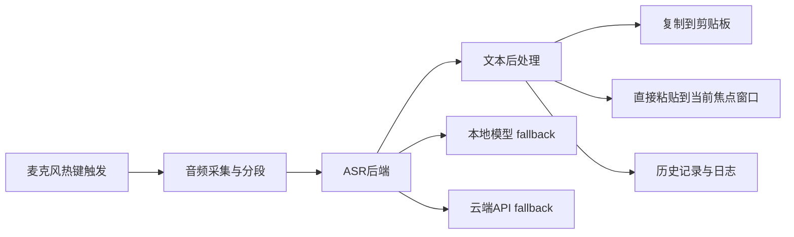
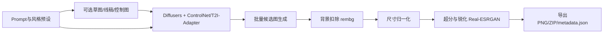

# 48小时内完成语音输入法与2D游戏素材生成的选题深研报告

## 执行摘要

如果目标是在 **48 小时内做出一个可演示、可测试、可交付的 MVP**，我更推荐选择 **题目一“语音输入法”**，但前提是你要**主动收缩题意**：把它定义为“**桌面语音输入助手 / 听写式输入器**”，而不是跨平台、系统级、原生 IME 引擎。这样做的原因很直接：现成 ASR 技术栈已经非常成熟，Whisper 本身具备大规模多语种、零样本泛化能力；`faster-whisper` 在相同精度下可以显著提升速度、降低显存；`whisper.cpp`、Vosk、`sherpa-onnx` 又分别覆盖 CPU 离线、轻量流式、多平台/WebAssembly 等落地路径。相较之下，2D 游戏素材生成虽然视觉效果更“炸裂”，而且 Diffusers、ControlNet、ComfyUI、Real-ESRGAN、rembg 组成的流水线也足够成熟，但它在 **结果一致性、透明背景质量、资产可复用率、显存与模型管理** 上更容易在 48 小时内失控。更重要的是，真正意义上的“输入法”若做系统级集成，实际会卷入 Fcitx5、Rime/librime 这类完整输入法框架/引擎，范围会明显膨胀。 citeturn33view0turn38view0turn23view0turn23view2turn38view1turn10view1turn10view0turn31view0turn31view1turn28view0turn14view5turn14view3

从 **AI 辅助开发效率** 看，两题都非常适合使用 Codex/ChatGPT/Codex-like 工具，但收益结构不同。Codex 官方定位就是可以 **写代码、理解旧仓库、审查代码、调试问题、自动化重复开发任务** 的 coding agent；Codex CLI 可以在本地终端直接读、改、跑代码；Codex web 还能在云端并行处理任务；ChatGPT canvas 则适合长代码和文档的反复编辑。对“语音输入法”这类以**胶水代码、系统集成、测试脚本、打包文档**为主的题目，AI coding agent 的净增益通常更大；对“2D 游戏素材生成”，AI 也能很快搭出 UI 和管线，但**视觉审美判断、提示词打磨和资产验收**仍然高度依赖人工。 citeturn35view0turn35view1turn35view2turn35view3

下文的推荐结论可以概括成一句话：**如果你要“稳交付”，选语音输入法；如果你已有稳定 GPU、会用 ComfyUI/Stable Diffusion，而且更想做“观感强”的 demo，2D 游戏素材生成可以作为次优解。**这一结论建立在官方文档、论文、项目主页与 GitHub 仓库现状之上。 citeturn33view1turn31view0turn31view1turn33view3

## 关键维度比较

| 维度 | 题目一 语音输入法 | 题目二 2D游戏素材生成 | 48小时判断 |
|---|---|---|---|
| 目标可实现性 | **高**，但仅限“热键听写 + 转写 + 提交/粘贴”的助手式 MVP | **中高**，但仅限“静态 PNG 资产生成”，不建议承诺逐帧动画 | 题目一更稳 |
| 开发架构清晰度 | 线性数据流明显：采集 → ASR → 后处理 → 输出 | 也较清晰，但会多出控制图、队列、后处理、资产打包 | 两题都清晰，题目一更收敛 |
| Codex/ChatGPT 辅助收益 | **高**，脚手架、热键、测试、打包、文档都适合 agent 化 | **中高**，能很快搭 UI/管线，但风格调优仍需人工 | 题目一更适合“AI 帮你冲刺” |
| 开源模型可用性 | **很高**，Whisper/faster-whisper/whisper.cpp/Vosk/sherpa-onnx 路线丰富 | **很高**，Diffusers/ControlNet/T2I-Adapter/Real-ESRGAN/rembg 成熟 | 都高 |
| 关键技术风险 | 系统集成、延迟、热词、文本注入 | 风格一致性、透明边缘、显存、模型下载与调度 | 题目二风险更“软且难收敛” |
| 所需数据与标注量 | **低**，MVP 可基本零标注；只需热词表或小词典 | **低到中**，不训练可零标注；若追求统一画风，很快会逼近微调/筛图工作 | 题目一更省心 |
| 成本估算 | 本地几乎零增量；云端也可很低 | 通常需要持续 GPU，成本上限更高 | 题目一更便宜 |
| 用户体验要点 | 低延迟、误识别可纠、提交动作自然 | 可控性、一致性、透明背景、导出格式可用 | 两题都需要细 UX |
| 测试与评估指标 | 更客观，可测延迟/CER/WER/提交成功率 | 更主观，要靠人工验收与“可用率” | 题目一更容易证明“做成了” |
| 开源/闭源组件比例 | 可做成高度开源；也可混合 OpenAI API | 也可高度开源，但若用商用图像 API 则闭源占比会迅速上升 | 两题都可开源优先 |
| 最终交付复杂度 | 功能、文档、视频、仓库都较容易定义 | 还要准备示例资产集与审美验收说明 | 题目一更容易打包成完整交付 |

之所以把题目一判为“更稳”，核心依据有三点。第一，Whisper 是大规模多语种、零样本鲁棒的通用 ASR，OpenAI发布页明确给出了 68 万小时训练规模、对口音/噪声/专业术语更强的鲁棒性；`faster-whisper` 在其基础上做了更快、更省显存的推理实现；`whisper.cpp` 进一步把路线压到 CPU、本地量化和跨平台 C/C++ 实现；Vosk 和 `sherpa-onnx` 又分别覆盖离线流式识别、可重配置词表、关键词唤醒、加标点、WebAssembly 和多语言。换句话说，**核心识别能力不是你要“攻克”的科学问题，而是你要“整合”的工程问题。** citeturn33view0turn38view0turn23view0turn23view2turn38view1

第二，题目一真正危险的部分不是 ASR，而是“输入法”三个字。Rime/librime 的仓库本身就是一个跨平台 C++ 输入法引擎，并且还要靠 IBus、Squirrel、Weasel、Fcitx5 等前端落地；Fcitx5 也是通用输入法框架，并提供了“自己开发一个输入法/插件”的开发路径。这说明如果你把范围扩成系统级输入法，你实际上在做一个更大的平台工程，而不是一个 48 小时竞赛题。**所以推荐不是“做输入法内核”，而是“做语音输入助手式 MVP”。** citeturn10view1turn10view0

把题目二评为“次优但不是不可做”，同样有充分依据。Diffusers 已经把扩散模型流水线、调度器、LoRA 与适配器加载、内存优化抽象成了可编排 API；ControlNet 明确支持用边缘图、深度图、姿态图等额外控制图去约束生成；T2I-Adapter 是更轻量的控制适配器，文档给出了约 77M 参数、约 300MB 文件体积；ComfyUI 则把这些能力包装成节点图式工作流；rembg 和 Real-ESRGAN 又把透明背景与超分修复补齐。这使得“做出能跑的 2D 资产生成器”非常现实。问题在于：**能跑 ≠ 能稳定地产出游戏可用资产。** 一旦你追求统一风格、精确轮廓、透明边缘干净、尺寸规范一致，就会进入肉眼反复挑图和参数调优阶段。 citeturn31view0turn31view1turn36view0turn28view0turn14view5turn14view3

在成本上，两题差距也比较明显。Hugging Face Inference Endpoints 官方价目显示 CPU 端点可以低到 **$0.033/小时**，T4 为 **$0.50/小时**，L4 为 **$0.80/小时**，A100 为 **$2.50/小时**；OpenAI 官方价格中，GPT-Realtime-Whisper 为 **$0.017/分钟**；AWS 文档示例给出的 S3 Standard 为 **$0.023/GB/月**。据此粗算，语音题如果走本地 `faster-whisper` 或 `whisper.cpp`，推理成本几乎可以忽略；即使用云端 CPU 端点进行 48 小时演示，费用也只是个位数美元到十几美元。2D 素材题若持续占用 T4/L4/L40S/A100，则 48 小时计算成本大约会落在 **$24 / $38.4 / $86.4 / $120** 这些量级，虽然不算天价，但比语音方案显著更高。 citeturn20view0turn20view1turn18view1turn37view0

## 推荐结论

我的明确推荐是：**优先选择题目一“语音输入法”**，并把最终方案命名为类似“**语音输入助手**”或“**按键触发式听写输入器**”。

这个推荐不是因为题目一“更简单”，而是因为它更适合在 48 小时内做出一个**闭环完整**的作品。你可以把最小闭环定义为：用户按住热键说话，系统进行流式或准实时识别，自动做中英文空格/标点/热词修正，然后把结果复制到剪贴板或直接粘贴到当前焦点输入框。这个闭环一旦打通，就已经具备明确的产品价值、可量化的测试指标、清晰的演示脚本，以及合理的后续路线图。Whisper 官方页面给出的架构图也很适合用于答辩中的概念说明；如果你需要展示“类似节点式工作流”的审美对照，也可以在备选方案部分引用 ComfyUI 仓库首页的官方界面截图。 citeturn33view0turn28view0

相反，题目二最适合的演示姿势其实不是“我做了一个很强的通用素材生成系统”，而是“我做了一个**限定范围的静态 2D 资产生成器**”。如果你执意做题目二，最可控的范围应当是：**图标、道具、UI 元件、立绘 cutout、简单平铺纹理**。我不建议你在 48 小时内承诺以下能力：角色逐帧动画、复杂 sprite sheet 自动生成、多风格统一训练、自定义 LoRA/Adapter 训练、完整材质库管理、多人协同审核。官方文档已经暗示了这条边界：Diffusers 虽然把推理管线抽象得很清楚，ControlNet 也提供很强的结构约束，但一旦你进入训练路线，T2I-Adapter 文档立刻会要求你准备训练数据、跑 `accelerate`、理解训练脚本参数，并用专门数据集和上万 step 训练，这就不再是“48 小时 MVP”了。 citeturn31view0turn31view1turn36view0

你只有在以下条件同时成立时，才值得把推荐反过来选题目二：你**已经有可用 GPU**，对 Stable Diffusion / ComfyUI / ControlNet **至少有基础经验**，并且你知道 demo 评审更吃“视觉观感”而不是“稳定可测”。如果这三个条件有任意一个不成立，选题目一通常更安全。 citeturn28view0turn31view1turn33view3

## 题目一 语音输入法的MVP设计

建议你把题目一的 MVP 精确定义成：**单平台优先、热键触发、实时/准实时语音转写、文本后处理、复制/粘贴提交、可配置热词表**。不要承诺“跨平台完整输入法框架”，不要在 48 小时内碰系统级候选框、输入法协议、复杂候选选择，更不要把 Fcitx/Rime 的引擎集成当作必做项。因为一旦你这么做，任务会从“调用成熟 ASR 组件的应用工程”升级为“输入法平台工程”。citeturn10view1turn10view0

推荐的最小技术路线是 **Python 桌面优先**。理由很现实：Whisper 原始实现、`faster-whisper`、Vosk、`sherpa-onnx` 都对 Python 友好；`WhisperLive` 还给出了现成的服务端/客户端拆分、浏览器扩展与热词支持示例。桌面 UI 可以用 PySide6 或者一个很轻的托盘窗口；音频采集可以走 `sounddevice` / PortAudio 类路线；提交动作先做**复制到剪贴板**，然后再补一个“粘贴到当前窗口”的快捷动作。这个路线最容易被 Codex/ChatGPT 快速补齐，因为它本质上是典型的“多模块胶水应用”。 citeturn23view5turn35view0turn35view1

如果你坚持“本地优先”，建议主路由用 `faster-whisper`，低配机器 fallback 到 `whisper.cpp` 或 Vosk。官方资料显示 `faster-whisper` 既支持 8-bit 量化，也能做到更快更省显存；`whisper.cpp` 强调纯 C/C++、CPU-only、量化与多平台；Vosk 则适合极轻离线与可重配置词表场景；`sherpa-onnx` 的价值在于它把**加标点、关键词唤醒、VAD、WebAssembly**等一整套周边能力都准备好了。对于 48 小时 MVP，最好的策略不是“选一条路梭哈”，而是 **主路径只做一个，预留一个 fallback**。 citeturn38view0turn23view0turn23view2turn38view1

在成本上，题目一非常友好。若本地跑推理，增量成本基本为零；若你短期上云，用 Hugging Face 官方 Dedicated Inference，CPU 最低是 **$0.033/小时**，T4 是 **$0.50/小时**，且按分钟计费；若为了演示准实时体验，直接上 OpenAI 的 GPT-Realtime-Whisper，官方价格是 **$0.017/分钟**。因此，48 小时内即使你一半时间都在开着云端服务，成本也通常仍在可接受区间。存储方面，音频和日志都很小，按 AWS S3 Standard **$0.023/GB/月** 计算，几 GB 级别的成本几乎可以忽略。 citeturn20view0turn18view1turn37view0

建议的 48 小时时间分配如下：

| 时间段 | 目标 | 产出 |
|---|---|---|
| 第 1–4 小时 | 定范围、搭仓库、让 Codex/ChatGPT 生成脚手架 | 可运行桌面壳子、任务清单、README 草稿 |
| 第 5–10 小时 | 接通音频采集与单次转写 | 本地录音 → 文本成功 |
| 第 11–16 小时 | 接 `faster-whisper` 主链路，加入热键 | PTT 录音、识别成功 |
| 第 17–22 小时 | 做后处理：中英空格、标点、热词修正 | 可读文本输出 |
| 第 23–28 小时 | 做提交动作：复制/粘贴、历史记录 | 从说话到落字的闭环 |
| 第 29–34 小时 | 加 fallback：`whisper.cpp` / API 模式二选一 | 低配或网络异常兜底 |
| 第 35–40 小时 | 写测试脚本与评估面板 | 延迟、CER/WER、成功率统计 |
| 第 41–44 小时 | 打包、录 demo、补文档 | 可安装或可运行版本 |
| 第 45–48 小时 | 精修 UX 与答辩材料 | 最终仓库、视频、汇报文档 |

风险控制上，最关键的不是识别准确率，而是**范围控制**。第一个风险是“题目理解过宽”，缓解方式是把 README 第一段就写成“本项目是桌面语音输入助手式 MVP，而非完整 OS 原生输入法”。第二个风险是延迟，缓解方式是从 `faster-whisper` int8 或更小模型起步，用本地短音频分段，不追求满血大模型。第三个风险是混合中英、专有名词和热词，缓解方式是先做 **JSON 热词表 + 后处理替换**，不要上来就训练。第四个风险是跨平台快捷键/注入差异，缓解方式是只承诺一个 demo 平台，例如 Windows 或 macOS，其他平台只写“理论兼容、未充分测试”。这些缓解基本都属于工程策略，而不是另一个研究项目。 citeturn38view0turn23view2turn23view5

测试建议也应尽量客观。至少要留出三类指标：**端到端延迟**、**文本质量**、**提交成功率**。你可以准备一套 50 句左右的内部测试语句，覆盖中文、英文缩写、数字、标点、常见产品名或专有名词；再做 20 次“用户在 Notion/微信/浏览器输入框中说一句话并提交”的稳定性测试。这样你提交的就不是“看起来能用”，而是“有指标地能用”。

## 题目二 2D游戏素材生成的MVP设计

如果你最终仍想选题目二，我建议你把 MVP 改写成一句更实在的话：**“面向静态 2D 游戏资产的可控生成器”**。其中“静态”很关键。控制范围最好只覆盖四类资产：**UI icon、单体道具 PNG、立绘/头像 cutout、简单 tile 纹理**。这比“一切 2D 游戏素材都能做”更真实，也更容易在 48 小时内做出质量稳定的结果。

技术路线方面，最稳妥的是 **Diffusers 代码优先，ComfyUI 工作流辅助**。Diffusers 官方文档明确说明它围绕 `DiffusionPipeline` 组织，支持管线组件拼装、LoRA、量化和 CPU offload；ControlNet 文档明确说明可以输入额外控制图来约束生成；T2I-Adapter 则是更轻量的控制适配器，约 77M 参数、约 300MB 文件，对显存更友好；Real-ESRGAN 负责放大和修复；rembg 负责背景扣除。ComfyUI 的优势是**你可以非常快地试工作流**，但它的代码级直接嵌入并不是 48 小时内最干净的路线，尤其当你还要考虑 GPL 许可影响时。 citeturn31view0turn31view1turn36view0turn14view3turn14view5turn28view0

如果你的 GPU 不强，建议放弃 SDXL 的野心，用 **SD1.5 + ControlNet** 或 **更小的控制链路**；如果你有 24GB 左右显存，才把 SDXL/T2I-Adapter 加进来。T2I-Adapter 文档虽然很吸引人，但也很诚实：一旦进入训练路线，你需要数据集、`accelerate`、训练脚本参数，以及官方示例中的专门训练步骤。这等于告诉你：**在 48 小时内，优先做“推理编排与后处理”，不要做“训练与微调”。** citeturn36view0turn31view1

成本上，题目二的上限更高。Hugging Face 官方价格里，T4 为 **$0.50/小时**，L4 为 **$0.80/小时**，L40S 为 **$1.80/小时**，A100 为 **$2.50/小时**。如果你连续占用 48 小时，费用大致是 **$24 / $38.4 / $86.4 / $120**。模型权重与缓存一般要占 10–25GB 左右级别的存储空间，即便用 S3 Standard **$0.023/GB/月** 也不贵，但下载、组织和反复调度本身会吃掉不少时间。因此，题目二真正贵的不是“存储费”，而是“你花在试错上的 GPU 小时数”。 citeturn20view1turn37view0

建议的 48 小时时间分配如下：

| 时间段 | 目标 | 产出 |
|---|---|---|
| 第 1–4 小时 | 锁定资产范围和风格预设 | 只做 2–3 类资产、风格表确定 |
| 第 5–10 小时 | 跑通基础文生图管线 | Prompt → 初始资产图 |
| 第 11–16 小时 | 接 ControlNet 或 T2I-Adapter | 草图/线稿控制成功 |
| 第 17–22 小时 | 对接 rembg 与尺寸归一化 | 透明 PNG 输出 |
| 第 23–28 小时 | 对接 Real-ESRGAN | 可用的放大后资产 |
| 第 29–34 小时 | 做批量生成、种子固定、Zip 导出 | 一次生成多候选并打包 |
| 第 35–40 小时 | 做小型图库、Meta 信息和评估面板 | 样例资产集、Prompt/Seed 记录 |
| 第 41–44 小时 | 用 Codex/ChatGPT 补 UI、文档、测试脚本 | 可演示 Web UI |
| 第 45–48 小时 | 录 demo、修边、清理坏样本 | 最终演示资产包 |

体验上，这题真正决定成败的不是“能不能生成图”，而是“**评审觉得这些图能不能拿去做游戏**”。所以你的 UX 要围绕“降低不可控性”设计：固定画幅、固定输出尺寸、固定透明背景、固定命名规范、固定 3 个风格预设、固定 1–2 种控制方式。换句话说，不要把 UI 做成一个大而全的生成玩具，而要把它做成一个**产出可用资产的窄工具**。

测试方面，这题不适合只报模型参数。你应该直接给出 **资产可用率**：例如 30 个提示词里，有多少次能在 4 张候选图中至少选出 1 张可直接用的 PNG；透明背景边缘失败率是多少；是否满足尺寸和命名规范；风格一致性在盲评中是否达标。相比语音题，这些指标更主观，也更难收敛，这也是它不如题目一稳妥的根本原因。

## GitHub参考仓库清单与48小时借鉴计划

以下 Star 数均以 **2026-05-23** GitHub 页面当前显示的近似值为准；GitHub 页面本身会对大仓库做四舍五入显示。

**语音输入法方向**

| 仓库 | Star | 简述与架构/技术栈 | 48小时优先借鉴的文件/模块/功能点 | 许可与避免抄袭提醒 |
|---|---:|---|---|---|
| `openai/whisper` citeturn4view1turn23view1 | 100k | Whisper 原始实现；Python + Transformer；模型和权重均开源。 | 直接参考根目录 `whisper/`、`notebooks/`、`tests/` 的调用方式与 CLI 组织；适合做**离线转写原型**。 | MIT；可借鉴调用范式与测试思路，**不要把 README、示例文案、仓库结构原样换皮提交**。 |
| `SYSTRAN/faster-whisper` citeturn4view2turn38view0 | 23.1k | 基于 CTranslate2 的 Whisper 重实现；主打更快、更省显存、支持 int8。 | 重点看 `faster_whisper/`、`benchmark/`、`docker/`；48 小时内最值得借的是**批量推理、量化与模型加载方式**。 | MIT；可直接作为主推理后端，避免把 benchmark 表格和结论不加说明地照搬进你的文档。 |
| `ggml-org/whisper.cpp` citeturn4view4turn23view0 | 50k | 纯 C/C++ 移植；CPU-only、量化、多平台、原生绑定丰富。 | 优先看 `whisper.h`、`examples/`、`bindings/`、`models/`；非常适合做**低配 fallback** 或性能对比路线。 | MIT；如果你的主体是 Python 应用，不必硬抄底层 C++ 代码，优先借**部署思路和轻量化策略**。 |
| `alphacep/vosk-api` citeturn8view1turn23view2 | 14.8k | 离线 ASR 工具包；支持 20+ 语言，小模型、流式、可重配置词表。 | 看 `python/`、`webjs/`、`android/`、`training/`；48 小时内最实用的是**离线小模型、词表/热词思路**。 | Apache-2.0；可直接参考 Python 与 Web 示例，避免把整套训练/多端支持范围写进 MVP 承诺。 |
| `k2-fsa/sherpa-onnx` citeturn16view0turn38view1 | 12.4k | ONNXRuntime 路线；除了 STT 还支持 TTS、VAD、KWS、加标点、WASM。 | 重点看 `python-api-examples/`、`nodejs-examples/`、`wasm/`、`build-wasm-simd-vad-asr.sh`；适合借**VAD+ASR、加标点与 Web/桌面多端样例**。 | Apache-2.0；功能很全，**不要因为它啥都有就把 MVP 做成“全家桶”**。 |
| `collabora/WhisperLive` citeturn24view0turn23view5 | 4k | 近实时 Whisper 转写系统；有服务端、客户端、浏览器扩展、热词支持。 | 重点借 `run_server.py`、`run_client.py`、`client_openai.py`、`whisper_live/`、浏览器扩展目录；非常适合做**准实时 demo**。 | MIT；适合作为“实时交互范式”的参考，避免只做一个轻度改皮的 fork。 |
| `rime/librime` citeturn11view0turn10view1 | 4.4k | Rime 输入法内核；跨平台 C++ 输入法引擎。 | 只建议把 `src/`、`plugins/`、`sample/`、`include/` 当作**理解真实输入法工程边界**的资料，不建议 48 小时内深改。 | BSD-3-Clause；它最有价值的地方是让你知道“**真正 IME 有多大**”，不是让你临时改内核。 |
| `fcitx/fcitx5` citeturn10view0 | 2.3k | 通用输入法框架；Linux/BSD 生态重要基础设施。 | 参考 `src/`、`data/`、`test/` 与其开发文档思路，理解**插件/输入法组件接口**。 | LGPL-2.1+；适合做范围边界研究，不适合临时当作主开发基座，除非你只做 Linux。 |

如果你最终选择题目一，**48 小时内真正优先级最高的组合**通常是：`faster-whisper` 作为核心推理、`WhisperLive` 作为实时交互参考、`whisper.cpp` 作为低配 fallback，Vosk 或 `sherpa-onnx` 作为轻量化/离线路线备选。`librime` 和 `fcitx5` 更像“防止你 scope creep 的边界材料”，而不是必接依赖。 citeturn38view0turn23view5turn23view0turn23view2turn38view1turn10view1turn10view0

**2D游戏素材生成方向**

| 仓库 | Star | 简述与架构/技术栈 | 48小时优先借鉴的文件/模块/功能点 | 许可与避免抄袭提醒 |
|---|---:|---|---|---|
| `AUTOMATIC1111/stable-diffusion-webui` citeturn15view0turn25view0 | 163k | 老牌 Stable Diffusion WebUI；Gradio + 丰富模块化功能。 | 借 `modules/`、`scripts/`、`webui.py`、`launch.py` 的组织方式；适合借**提示词样式、批量处理、平铺/高分修复等 UX 设计**。 | AGPL-3.0；**不建议直接拿大量源码嵌进你自己的闭源或轻改项目**，更适合作为产品功能表参考。 |
| `Comfy-Org/ComfyUI` citeturn4view3turn28view0 | 114k | 节点图式 AI 内容创作引擎；自带 API、后端与工作流图。 | 重点看 `nodes.py`、`server.py`、`openapi.yaml`、`script_examples/`、`custom_nodes/`；48 小时内最值得借的是**工作流拆解思路**。 | GPL-3.0；非常适合内部原型和答辩展示，但若你想保持自有代码库干净，**更建议把它当“工作流设计器”，不要直接做壳套壳**。 |
| `huggingface/diffusers` citeturn15view1turn25view1turn30view2turn31view2 | 33.7k | 代码优先的扩散模型库；管线、调度器、LoRA、ControlNet、offload 都齐。 | 重点看 `src/diffusers/`、`examples/`、`docs/`，以及 `pipeline_controlnet_inpaint.py`；非常适合做**你自己的干净 MVP 后端**。 | Apache-2.0；这是我最推荐直接集成进最终仓库的路线，避免照搬整段文档或示例 UI。 |
| `lllyasviel/ControlNet` citeturn15view2turn25view2 | 33.9k | 官方 ControlNet 实现；结构控制的事实标准之一。 | 重点看 `annotator/`、`gradio_annotator.py`、`gradio_canny2image.py`、`config.py`；最适合借**边缘/线稿/深度控制图生成与 demo 路径**。 | Apache-2.0；可直接参考控制图前处理逻辑，避免原样搬运 demo 图、说明文案和界面。 |
| `xinntao/Real-ESRGAN` citeturn15view3turn25view3 | 35.5k | 实用型图像/视频恢复与超分项目。 | 重点看 `inference_realesrgan.py`、`inference_realesrgan_video.py`、`README_CN.md`；48 小时内最实用的是**最终资产增强**。 | BSD-3-Clause；适合直接作为后处理组件，注意不要把“超分”误包装成你自己的核心创新。 |
| `danielgatis/rembg` citeturn15view5turn14view5turn30view1 | 23k | 背景移除工具；支持 CLI、Python、HTTP、Docker。 | 重点看 `rembg/`、`rembg.py`、`USAGE.md`、`Dockerfile_nvidia_cuda_cudnn_gpu`；非常适合完善**透明 PNG 导出链路**。 | MIT；可直接集成，但不要让你的产品沦为“只是套了个 rembg 的壳”。 |
| `invoke-ai/InvokeAI` citeturn15view4turn25view4turn30view0 | 27.2k | 更偏生产化的 Stable Diffusion 创作引擎；WebUI + 完整应用结构。 | 看 `invokeai/`、`docker/`、`scripts/`、`docs/`；适合借**更“产品化”的目录分层与部署组织**。 | Apache-2.0；适合学习应用工程结构，不要抄整个交互设计与品牌层表达。 |

如果你最终选题目二，我建议 **最终代码仓库** 以 `diffusers + ControlNet + rembg + Real-ESRGAN` 为核心，**ComfyUI 只作为内部调参和工作流原型工具**。`AUTOMATIC1111` 与 `InvokeAI` 更适合作为功能对照表和产品设计参考，而不是 48 小时内的直接代码基底。这样既能减少 copyleft 许可压力，又能更清楚地解释“你自己做了什么”。 citeturn25view0turn28view0turn25view1turn25view2turn25view3turn15view5turn25view4

## 最终交付清单

无论最终选哪题，我都建议把交付清单写得像一个小型产品发布，而不是一份“代码作业”。下面这份清单最适合 48 小时实战题的答辩逻辑。

| 交付项 | 题目一 语音输入法 | 题目二 2D游戏素材生成 |
|---|---|---|
| 核心功能 | 热键录音、实时/准实时转写、标点/热词修正、复制/粘贴提交、历史记录 | Prompt 生成、风格预设、可选草图控制、透明 PNG 导出、批量候选、Zip 打包 |
| 文档 | `README.md`、`architecture.md`、`eval.md`、`third_party_licenses.md`、`demo_script.md` | `README.md`、`pipeline.md`、`asset_spec.md`、`eval.md`、`third_party_licenses.md` |
| 演示视频 | 3–5 分钟：打开输入框 → 说话 → 落字 → 修正 → 粘贴 | 3–5 分钟：输入提示词/草图 → 生成 → 去背景 → 放大 → 导出 |
| 代码仓库 | `src/`、`tests/`、`configs/`、`.env.example`、启动脚本、打包脚本 | `app/` 或 `src/`、`workflows/`、`tests/`、`sample_outputs/`、启动脚本 |
| 评估材料 | 延迟统计、CER/WER 或人工比对、提交成功率、失败案例 | 资产可用率、透明边缘失败率、生成耗时、失败案例 |
| 额外加分项 | 本地/云端模式切换、热词表导入、日志面板 | 种子复现、metadata.json、统一命名规则、资产尺寸模板 |
| 许可与合规 | 列明 ASR 模型与库的许可证，说明是否调用闭源 API | 列明模型、控制器、后处理组件、示例资产的许可证与来源 |

如果跟随本报告的推荐，**题目一的最小可交付版本** 应该至少包含：一个能运行的桌面程序、一个可复现实验数据包、一个含性能与误识别案例的评估文档、一个 3–5 分钟演示视频、以及一份第三方模型/库许可证清单。做到这一步，作品已经具备“可跑、可测、可讲、可交”的完整性。题目二当然也能完成交付，但你需要花更多时间来证明“这些图真的能拿来做资产”，这正是它在 48 小时里不如题目一稳妥的地方。